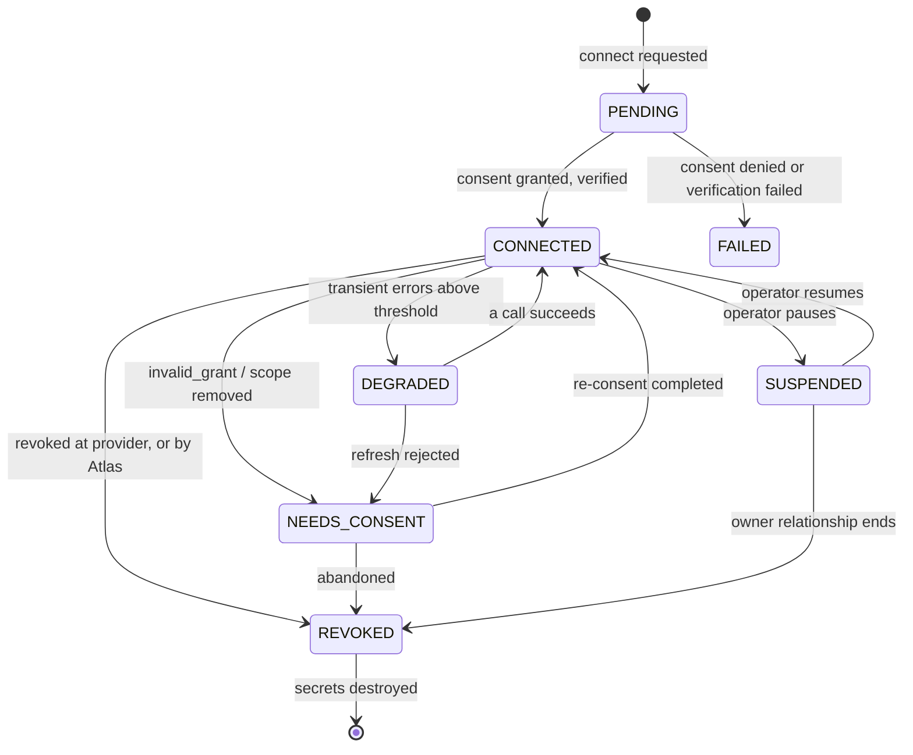
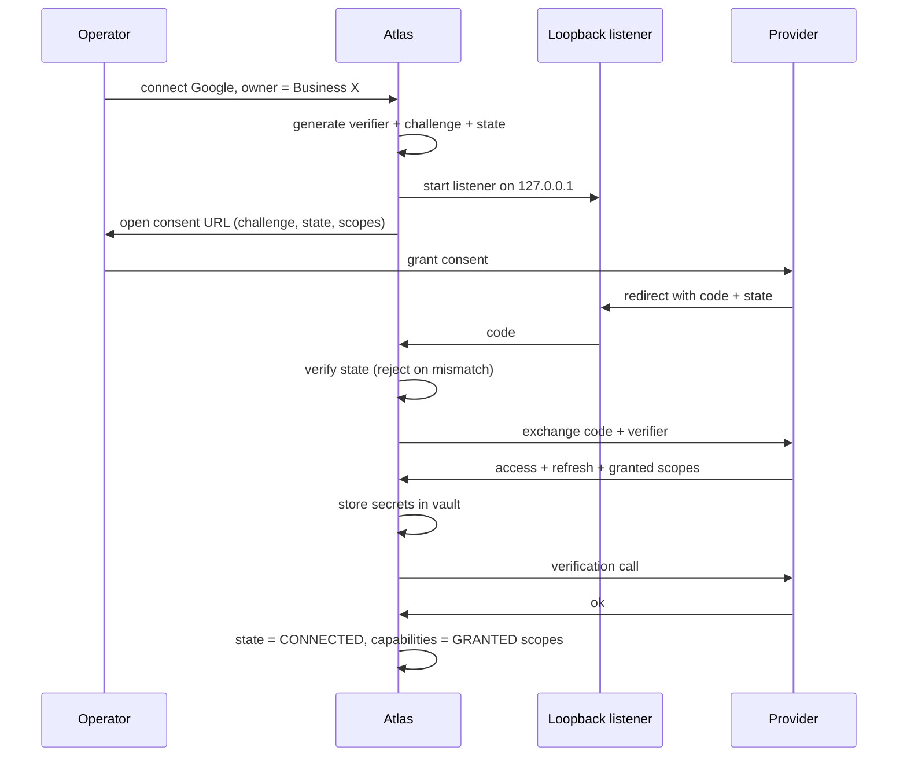
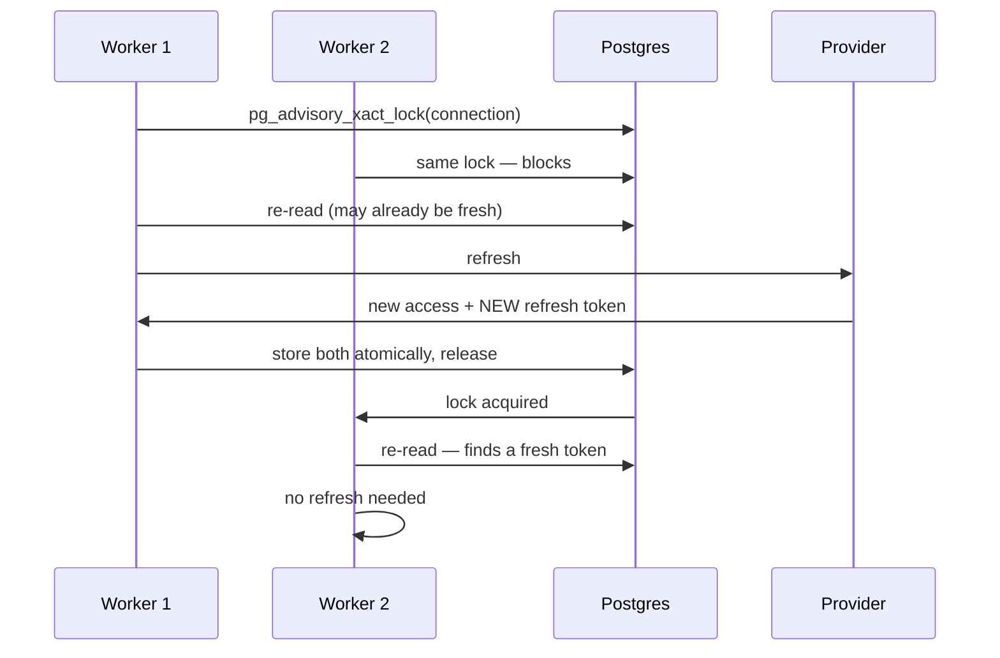
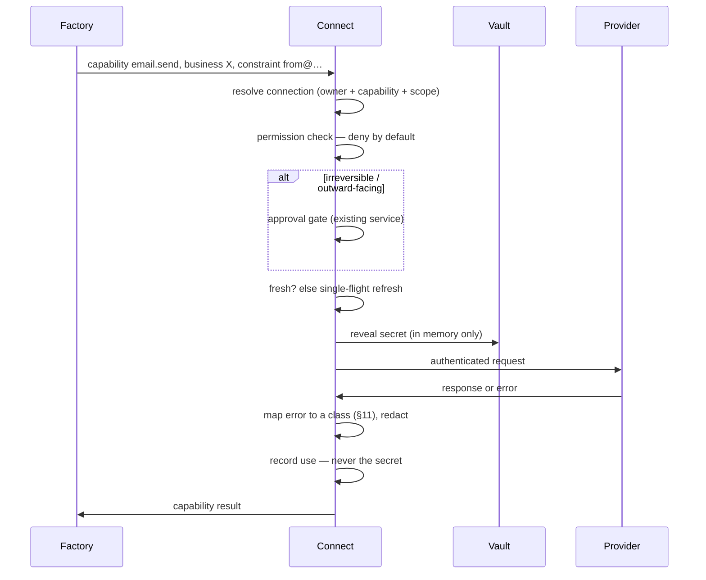
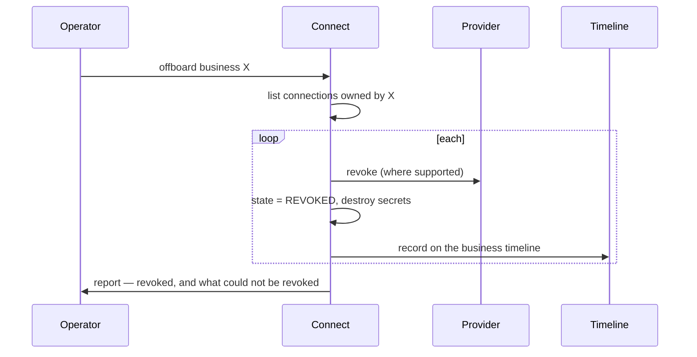

# Atlas Connect — architecture blueprint

**Design document. Nothing here is implemented.** No adapters, no OAuth code, no
migrations. This is the permanent blueprint for how every factory reaches an
external service.

Governed by [`SHIP_RULE.md`](../SHIP_RULE.md) and `CLAUDE.md`. It follows the
discipline already proven in M013–M015 rather than inventing a new one, and where
it departs from them the departure is argued.

---

## 1. What this is for

Atlas is about to hold credentials for Google, Cloudflare, Hetzner, Amazon,
YouTube, Stripe and WhatsApp — some belonging to Ayoub's companies, and some
belonging to **customers**. Every factory will need them, and each will be
tempted to solve it locally.

Atlas Connect exists so there is exactly one answer to five questions:

| Question | Answer lives in |
|---|---|
| Who is this credential for? | The **owner** — Atlas, or a specific `Business` |
| What may it do? | Its **granted capabilities**, within a **scope of authority** |
| Where is the secret? | The **vault** — never in an entity row, never in a log |
| Is it still good? | The **connection state**, and the health that produced it |
| Who asked, and was it allowed? | **Permission** at bind time, **approval** at action time |

**The rule it exists to protect:** a factory asks for a *capability*, never for a
vendor. The kernel must not know whether an email left through Gmail or Resend,
any more than it knows whether a video came from Wan or Seedance.

### Explicitly not

- Not a secrets-management product. No sharing, no teams, no audit UI beyond what
  Atlas needs to operate.
- Not a universal API wrapper. See §10 — that abstraction always leaks.
- Not a replacement for `atlas_kernel.approval`. Permission and approval are
  different questions and both are asked.

---

## 2. Identity model

Four entities. The separation matters more than the fields.

```
Owner ──owns──▶ Connection ──authenticates──▶ ExternalIdentity ──at──▶ Provider
                     │
                     ├──grants──▶ Capability[] within Scope
                     └──holds───▶ SecretRef[] ──▶ Vault
```

### Owner — whose credential this is

The most Atlas-specific decision in the document, and the one most likely to be
got wrong by omission.

```
Owner = ATLAS | Business(business_id)
```

- **`ATLAS`** — the operating company's own accounts. Ayoub's Cloudflare, the
  Hetzner box, the outreach mailbox.
- **`Business(id)`** — a **customer's** account, connected so Atlas can work on
  their behalf. Their Cloudflare zone, their Seller Central, their Google
  Business Profile.

There is no third option and no default. A connection with an ambiguous owner is
a connection nobody can revoke correctly when a relationship ends. See §8.

`business_id` is the same immutable id every factory already uses. There is no
new customer entity — enforced by `tests/test_one_customer_entity.py`.

### ExternalIdentity — the account at the far end

One owner may have several accounts with one provider: two Gmail addresses, two
Cloudflare accounts, seller accounts in UAE *and* KSA. Binding credentials to
"the provider" instead of "the account at the provider" is a mistake that only
shows up on the second account, by which time it is load-bearing.

> **Naming note, and a real consequence of an existing rule.** The obvious name
> is `ProviderAccount`. Its head noun is *account*, which
> `tests/test_one_customer_entity.py` flags as a second customer record — and
> that guard is right to be suspicious: an "account" is exactly the kind of thing
> that quietly becomes a second customer table. `ExternalIdentity` says what it
> is without the collision.

### Principal — who is acting

Recorded on every connection use, because "Atlas did it" is not an answer when
something goes wrong.

```
Principal = SYSTEM | Operator(operator_id) | Factory(name)
```

### Connection — the binding

An owner's authenticated link to one external identity, granting specific
capabilities within a specific scope, backed by secrets in the vault.

---

## 3. Data model

Field lists, not DDL. Types and constraints are stated where they carry meaning.

### `atlas_connections`

| Field | Notes |
|---|---|
| `id` | Immutable. Referenced by every use record. |
| `owner_kind` | `atlas` \| `business` — **not null, no default** |
| `owner_business_id` | Null iff `owner_kind = atlas`. A check constraint enforces the pairing, because the invalid state is the dangerous one. |
| `provider` | Registered provider name. Never a class, never a URL. |
| `external_identity` | Provider's account id — Google `sub`, Cloudflare account id, seller id |
| `display_name` | What a human recognises. `hello@teqtronix.ae`, not a UUID. |
| `state` | See §6 |
| `granted_capabilities` | The capabilities this connection actually grants — **derived from what the provider returned**, never from what was requested. |
| `scope_of_authority` | Structured limits: which zones, which addresses, which seller marketplaces. See §9. |
| `secret_ref` | Pointer into the vault. **No secret material here, ever.** |
| `expires_at` | Access-credential expiry, for proactive refresh |
| `last_verified_at` | When Atlas last confirmed it works |
| `health` | Last error class and message, redacted |
| `connected_by` | Principal |
| `created_at`, `updated_at`, `revoked_at` | |

**No token column. No refresh-token column.** Someone will eventually add one
"just for debugging"; the schema not having anywhere to put it is the defence.

### `atlas_connection_secrets` — the vault

| Field | Notes |
|---|---|
| `ref` | Primary key, referenced by the connection |
| `version` | Monotonic. Rotation writes a new version; the old stays until the new one is proven. |
| `kind` | `oauth_access` \| `oauth_refresh` \| `api_token` \| `ssh_key` \| `webhook_signing` |
| `ciphertext` | Encrypted secret |
| `wrapped_data_key` | Envelope encryption — §4 |
| `algorithm`, `key_id` | So a re-key can find what needs re-wrapping |
| `created_at`, `retired_at` | |

Separate table, deliberately. It can be dumped, encrypted, backed up and
access-controlled on a different schedule from operational data, and an accidental
`SELECT *` on connections does not produce secrets.

### `atlas_connection_uses`

Append-only. Not one row per HTTP request — one row per **capability invocation**.

| Field | Notes |
|---|---|
| `connection_id`, `principal`, `capability` | Who did what with which link |
| `outcome` | `ok` \| error class from §11 |
| `business_id` | Null unless acting for a business — this is how a customer can be told what was done in their name |
| `approval_id` | Set when the action passed an approval gate |
| `at` | |

Errors are recorded with their **class**, never their raw provider payload — those
carry tokens.

### `atlas_provider_registrations`

Static in code, mirrored to a table only if runtime registration is ever needed.
Registry is a code artifact by default (§5).

---

## 4. Secret management

### Envelope encryption

```
master key (outside the database)
   └─ wraps ─▶ data key (per secret, random)
                  └─ encrypts ─▶ secret material
```

Why not encrypt directly with the master key: rotating it would mean decrypting
and re-encrypting every secret, which is exactly the operation nobody performs.
Re-wrapping data keys is cheap, so rotation becomes possible rather than
theoretical.

### Where the master key lives

Atlas runs in two places, and this is the hardest unsolved problem in the design
(§13).

| Environment | Source | Note |
|---|---|---|
| Desktop | OS keychain | macOS Keychain / Windows DPAPI. Bound to the user account. |
| Server / headless | Environment or a file outside the data directory | Deliberately not in the data directory: a database backup must not contain the key that decrypts it. |

**Never derived from a hardcoded value and never stored beside the ciphertext.**
A backup that decrypts itself is not encrypted.

### The secret type

```python
class SecretValue:
    """A secret that refuses to be printed.

    `__str__` and `__repr__` return "***". Reading the material requires an
    explicit `.reveal()`. `__eq__` is constant-time.
    """
```

This is the same technique the codebase already uses: `Finding` cannot exist
without evidence, `FactSource` has no `GENERATED` member. Make the wrong thing
impossible to express rather than documented as forbidden. The failure it
prevents is mundane and near-certain — a token in an exception message, a log
line, or an event payload.

**Corollaries, each a rule:**

- Secrets never enter `BusinessEvent`, `atlas_connection_uses`, or any exception
  message. Error mapping (§11) strips before it records.
- Provider error bodies are **redacted before storage**, not after.
- Rotation is versioned: write the new version, verify it works, retire the old.
  Deleting first is how a failed rotation becomes an outage.

---

## 5. Provider registry

Same shape as the media provider registry and `site.deploy` — because it works and
because a second registry pattern is a second thing to learn.

A provider declares:

| Declares | Example |
|---|---|
| `name` | `google`, `cloudflare`, `stripe` |
| `capabilities` | `email.send`, `calendar.read` |
| `auth_kind` | `oauth2_pkce` \| `oauth2_client` \| `api_token` \| `ssh_key` |
| `scope_grammar` | How scope-of-authority is expressed for this provider |
| `refresh_kind` | `rotating` \| `static` \| `none` — this changes the refresh algorithm (§7) |
| `rate_limits` | Declared, so the transport can respect them before being told to |
| `is_local`, `cost_hint` | For selection, as media providers already do |

**The registry is code, not configuration.** A provider is a small module that
registers itself. Runtime-registered providers would mean arbitrary endpoints
receiving credentials, which is a vulnerability wearing a feature's clothes.

### Resolution

A factory asks for `(capability, owner, constraint)`. The registry returns
connections that satisfy all three, ordered by the existing preference rule
(local first, then cost, then name). **A named provider that is not registered is
an error, never a silent substitution** — the same rule `site.deploy` follows,
for the same reason: deploying a customer's site somewhere other than intended is
worse than not deploying it.

---

## 6. Connection lifecycle



The states that matter:

- **`DEGRADED`** — still usable, failing more than it should. Exists so a
  provider having a bad hour is not confused with a broken connection, and so
  "why is this slow" has an answer.
- **`NEEDS_CONSENT`** — a human must act. **Atlas never retries its way out of
  this**, because retrying a rejected grant is how a provider decides you are
  hostile.
- **`SUSPENDED`** — deliberately paused. Distinct from broken; a suspended
  connection is not an incident.
- **`REVOKED`** is terminal, and entering it **destroys the secrets**. A revoked
  connection that still holds a usable token is the worst object in the system.

Verification is not optional: a connection reaches `CONNECTED` only after a real
call succeeds. A stored credential nobody has exercised is a guess.

---

## 7. OAuth and refresh

### Authorization — desktop, PKCE



Two details that are the whole security of this flow:

- **`state` is verified before the code is used.** Skipping it accepts an
  attacker's authorization code.
- **Granted capabilities come from the provider's response**, not from what Atlas
  asked for. Users deselect scopes on consent screens, and a connection that
  believes it can do more than it can fails later, in production, mid-task.

### Refresh — proactive *and* reactive

Refresh before expiry with a skew (~5 minutes), **and** handle a 401 as a
fallback. Not belt-and-braces for its own sake: clocks disagree and providers
revoke early, so proactive alone breaks and reactive alone means every expiry
costs a failed request.

### Single-flight refresh — the concurrency trap

The bug that will otherwise happen, once, in production, and be very hard to read:

> Two workers use one connection. Both see an expired token. Both refresh. With
> **rotating** refresh tokens — Google's default — the provider invalidates the
> old refresh token on first use. The second refresh presents a dead token, gets
> `invalid_grant`, and the connection drops to `NEEDS_CONSENT`. Nothing looks
> broken; a customer's integration simply stopped, and the logs show a valid
> refresh followed by a rejected one.



Three rules fall out:

1. Refresh holds a **per-connection advisory lock**.
2. The holder **re-reads after acquiring** — the common case is that someone else
   already did the work.
3. New access and new refresh tokens are stored **in one transaction**. A crash
   between them loses the connection permanently.

`refresh_kind = rotating | static | none` is declared per provider precisely
because rotating providers make this mandatory rather than merely tidy.

### Using a capability



The factory never sees the secret, never sees the provider, and never sees a raw
provider error. It sees a capability result or a typed failure.

---

## 8. Business ownership of credentials

The section most likely to be skipped and most likely to matter legally.

When Atlas holds a customer's Cloudflare token, Atlas holds the ability to take
their website down. That is a real responsibility and the design must state how
it ends, not only how it begins.

### Rules

1. **Ownership is explicit at creation.** No default, no inference. A connection
   without a clear owner cannot be created.
2. **Delegated access is preferred over held credentials** where a provider
   supports it — a scoped Cloudflare API token for one zone rather than a Global
   API Key; a Google service account with domain delegation rather than a
   personal refresh token. Prefer the credential that is *narrow and revocable by
   them*.
3. **Scope of authority is recorded and enforced**, not merely requested. A
   connection for one zone must be unusable against another, checked by Atlas
   before the call — a provider-side scope that Atlas does not also enforce is a
   scope Atlas cannot reason about.
4. **The customer can be told what was done in their name.** `business_id` on
   every use record exists for this. "We do not know" is not an acceptable answer
   to a customer asking what was changed.
5. **Offboarding is a defined operation, not a cleanup task.** When a
   relationship ends: revoke at the provider where the API allows, mark
   `REVOKED`, **destroy the secrets**, and keep the use history — which contains
   no secrets and is the record of what was done.
6. **Atlas never uses a business-owned connection for Atlas's own purposes.**
   The owner check is not advisory. A customer's mailbox is not an outreach
   channel, and a customer's Cloudflare account is not somewhere to park an
   experiment.

### Handback



What **cannot** be revoked programmatically is reported explicitly, so a human
finishes the job. Silence there would mean a customer believing access ended when
it had not.

---

## 9. Permission model

Two distinct questions, and conflating them is a common design error:

| Question | Mechanism | When |
|---|---|---|
| *May this connection do this at all?* | **Permission** — granted capabilities ∩ scope of authority | Every use |
| *Should this specific action happen?* | **Approval** — the existing `atlas_kernel.approval` service | Outward-facing or irreversible actions only |

Permission is a property of the connection. Approval is a decision about an
outcome. A connection may be permitted to send email and still require approval
to send *this* email — which is exactly the M014 outreach gate, unchanged.

**Deny by default.** A capability not in `granted_capabilities` is unavailable;
there is no "try it and see". Scope of authority is structured per provider:

```
cloudflare : { zones: ["teqtronix.ae"] }
google     : { addresses: ["hello@…"], scopes: [gmail.send] }
amazon     : { seller_ids: [...], marketplaces: ["AE","SA"] }
stripe     : { account: "acct_…", mode: "live" | "test" }
```

`mode` on Stripe is illustrative of the general point: **the scope must be able to
express the distinction that matters most for that provider.** For payments that
is live-versus-test, and a scope grammar unable to say it is a scope grammar that
will one day charge a real card.

---

## 10. API abstraction — layered, and deliberately not universal

The tempting design is one interface over every provider. It always leaks, because
providers differ in exactly the ways that matter, and the leak surfaces as
`if provider == "..."` in code that swore it did not know about providers.

**Three layers, each with a different job:**

| Layer | Knows about | Used by |
|---|---|---|
| **1. Authenticated transport** | HTTP, auth headers, refresh, retry, rate limits | Adapters |
| **2. Capability interfaces** | One capability, narrowly | **Factories** |
| **3. Provider adapters** | One provider's API | Nothing above them |

Layer 2 is the contract, and each interface is designed **against at least two
providers** before it is trusted — the rule that produced `publish`-then-`promote`
for `site.deploy`, where designing against one host would have encoded that
host's mechanics. An interface validated by one implementation is validated by
nobody.

Capability interfaces stay **narrow**. `EmailSender` sends an email; it does not
model labels, threads, filters and drafts because Gmail has them. A capability
is defined by what factories need, not by what the richest provider offers —
otherwise the interface becomes a description of one vendor with the others
awkwardly padded to fit.

Where a factory genuinely needs provider-specific behaviour, it uses layer 1 with
an explicit provider name and says so. **A named exception is safer than a leaky
abstraction**, because it is visible and greppable rather than pretending.

---

## 11. Error handling

Integrations rot when every failure looks the same. Seven classes, each with a
different correct response:

| Class | Meaning | Response |
|---|---|---|
| `Transient` | Timeout, 502, connection reset | Retry with backoff and jitter |
| `RateLimited` | 429, quota | Back off, **honour `Retry-After`**, do not retry blind |
| `AuthExpired` | Credential aged out | Single-flight refresh, retry once |
| `AuthRevoked` | `invalid_grant`, consent withdrawn | → `NEEDS_CONSENT`. **Never retry.** Ask a human. |
| `PermissionDenied` | Valid credential, missing scope | Fail fast. Re-consent with the right scopes — retrying cannot help. |
| `ProviderError` | 5xx, provider incident | Retry within limits, then `DEGRADED` |
| `Misconfiguration` | Bad account id, wrong zone, malformed | **Fail loudly and immediately.** Never retry — the same request fails forever and the retries make it look intermittent. |

Two rules that matter more than the table:

**Retry only what retrying can fix.** `PermissionDenied` and `Misconfiguration`
retried are noise that hides the real problem and burns quota.

**Redact before recording.** Provider error bodies contain tokens. Redaction
happens in the mapping step — before anything is written — because a redaction
applied afterwards is a redaction someone will forget on a new code path.

Failures surface on the **business timeline** for business-owned connections, so
"why did this stop" is answerable per customer.

---

## 12. Folder structure

```
packages/kernel/atlas_kernel/connect/
├── __init__.py           no eager imports, matching media/opportunity/website
├── models.py             Owner, Connection, ExternalIdentity, Principal, state
├── secrets.py            SecretValue, envelope encryption, rotation
├── vault.py              storage + master-key resolution per environment
├── registry.py           provider registration and resolution
├── permissions.py        capabilities ∩ scope of authority; deny by default
├── lifecycle.py          state machine and transitions
├── oauth.py              PKCE flow, state verification, exchange
├── refresh.py            single-flight refresh, rotating-token handling
├── transport.py          layer 1 — authenticated HTTP, retry, rate limits
├── errors.py             the seven classes and the mapping
├── repository.py         persistence
├── service.py            the one entry point factories use
├── capabilities/         layer 2 — narrow interfaces
│   ├── email.py
│   ├── dns.py
│   ├── object_store.py
│   ├── messaging.py
│   ├── payments.py
│   └── marketplace.py
└── providers/            layer 3 — one module per provider
    ├── google.py
    ├── cloudflare.py
    ├── hetzner.py
    ├── amazon.py
    ├── stripe.py
    └── whatsapp.py
```

Kernel, not a factory: every factory uses it, and `CLAUDE.md` already lists Vault
and Auth as kernel concerns.

---

## 13. Interfaces

Signatures and contracts. **No bodies — this is design.**

```python
class ConnectService:
    """The one entry point. Factories use this and nothing below it."""

    def begin_connect(self, provider: str, owner: Owner, capabilities: list[str],
                      *, principal: Principal) -> ConnectHandle: ...
    def complete_connect(self, handle: ConnectHandle, callback: dict) -> Connection: ...

    def resolve(self, capability: str, owner: Owner,
                constraint: dict | None = None) -> Connection:
        """The registered connection satisfying all three. Raises rather than
        substituting: a silent fallback to a different account is worse than a
        failure."""

    def use(self, capability: str, owner: Owner, request: object, *,
            principal: Principal, constraint: dict | None = None) -> object:
        """Resolve, check permission, refresh if needed, invoke, record.
        The secret never crosses this boundary."""

    def verify(self, connection_id: str) -> ConnectionHealth: ...
    def suspend(self, connection_id: str, principal: Principal) -> Connection: ...
    def revoke(self, connection_id: str, principal: Principal) -> Connection:
        """Revoke at the provider where possible, destroy secrets, keep history."""
    def offboard(self, business_id: str, principal: Principal) -> OffboardReport:
        """Revoke every connection a business owns. Reports what could not be
        revoked programmatically, so a human can finish."""


class Provider(Protocol):
    """Declares itself. Registered in code, never at runtime."""
    name: str
    capabilities: frozenset[str]
    auth_kind: AuthKind
    refresh_kind: RefreshKind

    def authorize_url(self, request: AuthRequest) -> str: ...
    def exchange(self, callback: dict, request: AuthRequest) -> IssuedCredential: ...
    def refresh(self, credential: IssuedCredential) -> IssuedCredential: ...
    def revoke(self, credential: IssuedCredential) -> None: ...
    def verify(self, credential: IssuedCredential) -> ExternalIdentity: ...
    def map_error(self, error: Exception) -> ConnectError:
        """Provider-specific failure → one of the seven classes. Redacts."""


class Vault(Protocol):
    def put(self, ref: str, kind: SecretKind, value: SecretValue) -> SecretVersion: ...
    def reveal(self, ref: str) -> SecretValue:
        """In memory only. Never logged, never serialised, never in an event."""
    def rotate(self, ref: str, value: SecretValue) -> SecretVersion:
        """New version; old retired only after the new one verifies."""
    def destroy(self, ref: str) -> None: ...


class EmailSender(Protocol):
    """Layer 2, deliberately narrow. Designed against at least two providers
    before it is trusted."""
    def send(self, message: OutboundEmail) -> SentMessage: ...


class DnsManager(Protocol):
    def records(self, zone: str) -> list[DnsRecord]: ...
    def upsert(self, zone: str, record: DnsRecord) -> DnsRecord: ...
    def delete(self, zone: str, record_id: str) -> None: ...
```

---

## 14. Risks

Ordered by what would hurt most.

| # | Risk | Why it is serious | Mitigation |
|---|---|---|---|
| 1 | **Master key management** | Everything else is decoration if the key is wrong. On a desktop app there is no good universal answer. | OS keychain on desktop; env/file outside the data directory on servers; never in a backup with the ciphertext. **The weakest part of this design — see §15.** |
| 2 | **Blast radius of a customer connection** | One token can take a customer's site down or read their mail. | Narrow, revocable credentials by default; scope enforced by Atlas as well as the provider; owner check non-advisory |
| 3 | **Rotating-token refresh race** | Silent, permanent, and looks like the provider's fault | Single-flight lock, re-read after acquire, atomic store (§7) |
| 4 | **Secret leakage into logs and events** | Near-certain without a type-level defence | `SecretValue` that refuses to stringify; redact in error mapping, not after |
| 5 | **Provider terms on storing customer credentials** | A legal problem no amount of engineering fixes | Prefer delegated/scoped tokens; record what was accepted; **check per provider before storing** |
| 6 | **Abstraction leak** | Ends as `if provider ==` in code that claimed not to know | Narrow capability interfaces; design each against two providers; named layer-1 exceptions instead of pretending |
| 7 | **Scope creep into a secrets product** | The most likely SHIP-1 violation here | No sharing, no teams, no policy engine. Build what factories need. |
| 8 | **Silent partial offboarding** | A customer believes access ended when it did not | `offboard` reports what it could not revoke; the report is the deliverable |

---

## 15. Tradeoffs

Each with a side chosen, because a tradeoff listed without a decision is a
decision deferred to whoever implements it.

**Encrypted-in-database vs external secret manager.** → *Envelope encryption in
Postgres now, behind a `Vault` interface.* Atlas runs on a desktop and on one
server; a managed secret manager is another dependency, another credential, and
another thing that is down. The interface means moving later is an adapter.

**Wrap the APIs vs hand out authenticated clients.** → *Both, layered.* A pure
wrapper leaks; pure clients mean every factory learns every provider. Layer 2 for
what factories need, layer 1 with a named provider for the rest.

**Proactive vs reactive refresh.** → *Both.* Clocks disagree and providers revoke
early, so proactive alone breaks; reactive alone spends a failed request on every
expiry.

**One connection per provider vs per external identity.** → *Per identity.* Two
seller accounts and two Cloudflare accounts already exist. The cost is one extra
concept; the alternative is a rewrite on the second account.

**Hold customer credentials vs delegated access only.** → *Support both; prefer
delegated.* Delegated is not always available, and refusing to hold credentials
would mean refusing work. The mitigation is narrowness and a defined exit, not
abstention.

**Capability granularity.** → *Coarse, driven by what factories ask for.*
`email.send` rather than `email.send.with_attachments`. Splitting later is easy;
un-splitting a permission model everything depends on is not.

**Registry in code vs configuration.** → *Code.* Runtime-registered providers mean
arbitrary endpoints receiving credentials.

**Record every request vs every capability invocation.** → *Invocation.* Per-request
logging is volume without meaning; the question people ask is "what did Atlas do
in my name", and that is an invocation.

---

## 16. Open questions

Not blockers for the design, and each needs an answer before the code they touch.

1. **Desktop master key when the OS keychain is unavailable** — headless CI, a
   fresh VM, a user who declines. Prompt, refuse, or degrade to
   connect-per-session? Currently unanswered, and it is risk #1.
2. **Per-provider terms on storing customer credentials.** Must be checked
   provider by provider before the first customer connection, not assumed.
3. **Shared vs per-business Atlas credentials for a customer's site.** Deploying a
   customer's site to Ayoub's Cloudflare account is simpler and means Atlas holds
   the domain relationship. That is a business decision about lock-in and
   liability, not a technical one.
4. **Rate limits shared across factories.** One provider quota, several factories.
   Fair-share or first-come? Only becomes real with volume, and by then it is
   noticeable.

---

## 17. What the first implementation should be

Design does not schedule work, but the shape should be stated so it is not
over-built on day one. Under SHIP-1:

**The first slice is the smallest thing that connects one provider end to end** —
models, vault, registry, lifecycle, PKCE, single-flight refresh, error mapping,
and **one** provider with **one** capability, verified against the real service.

Everything else in this document is a registration or an interface implementation
on top of a spine that already works. Building the full provider set before one
connection has been used in anger would be building an integration platform
instead of connecting Atlas to Gmail.
